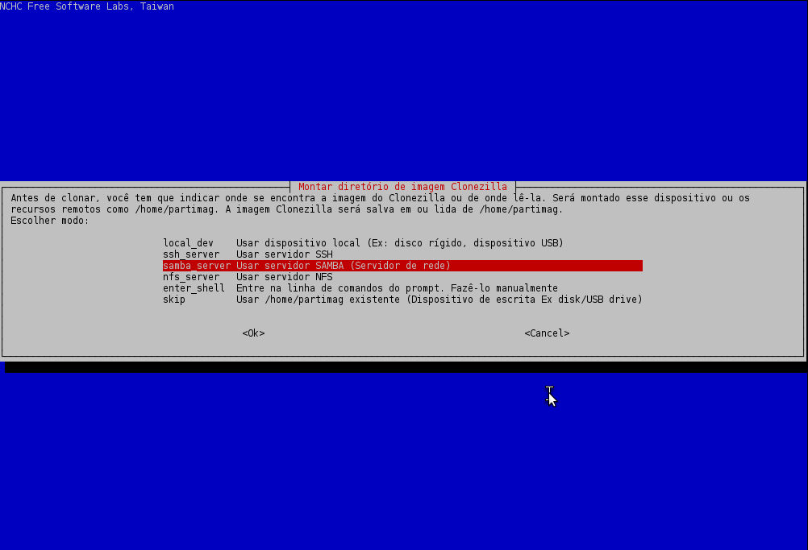
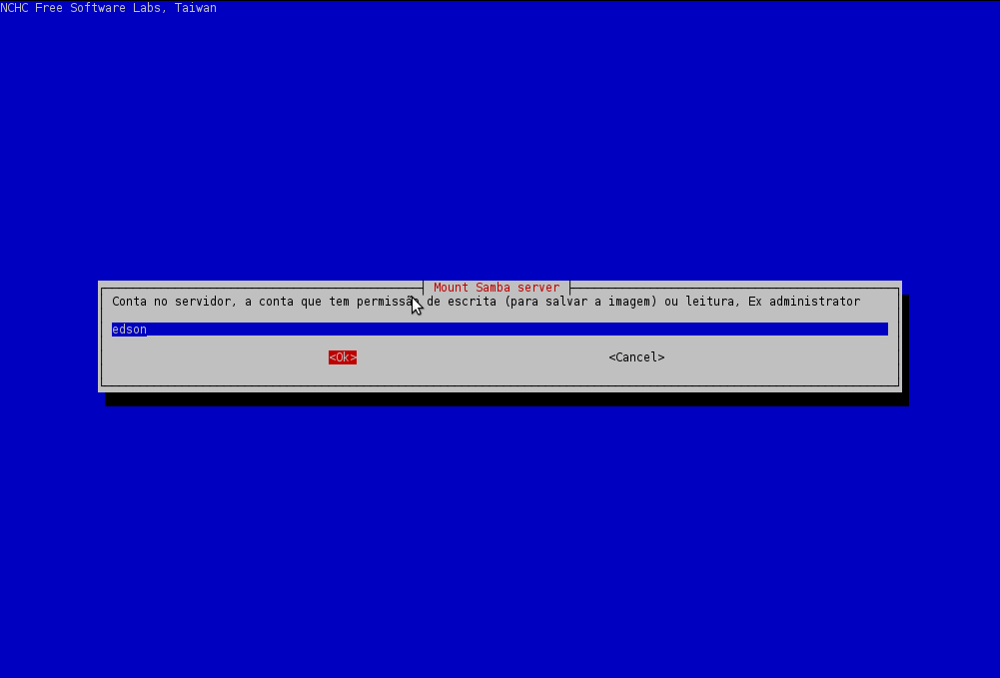
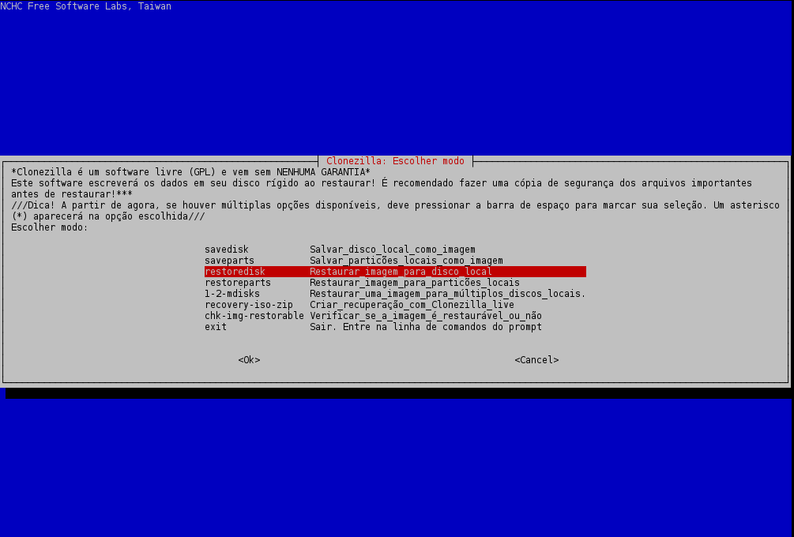
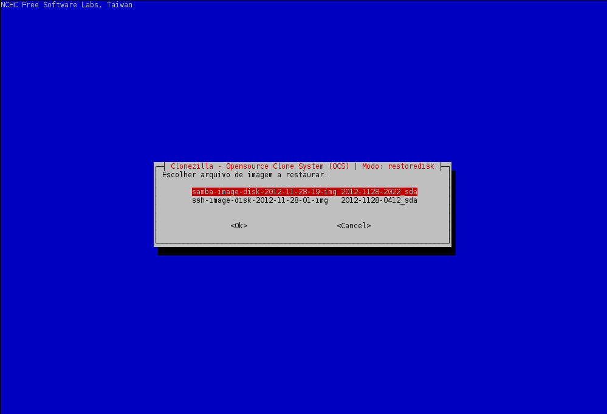
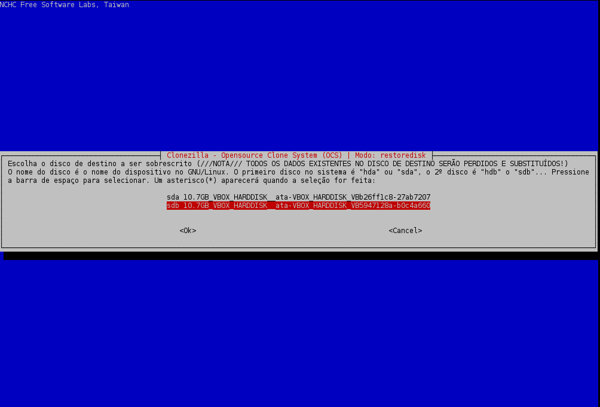
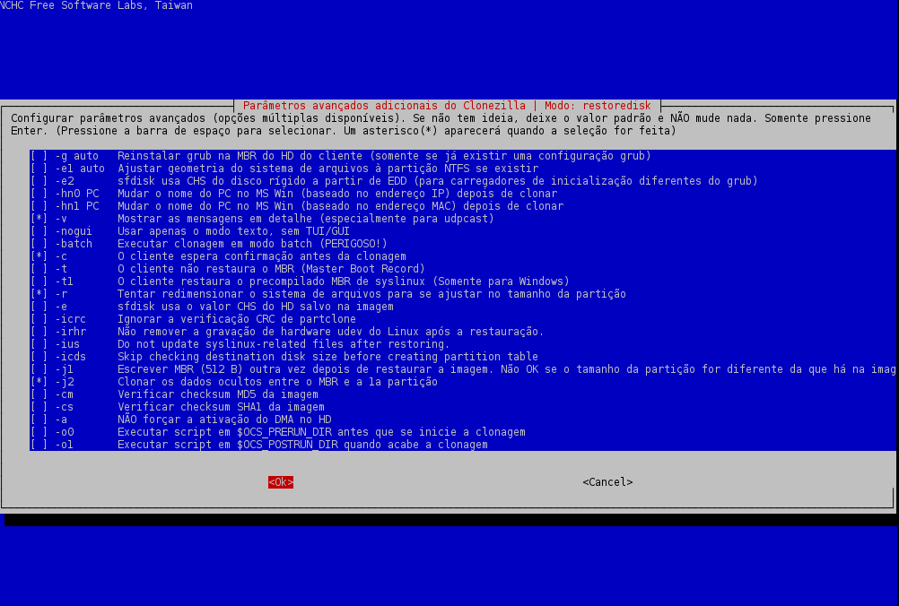
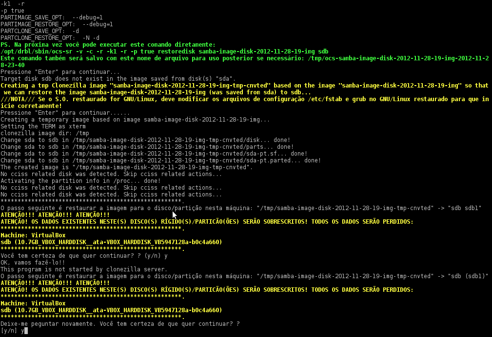
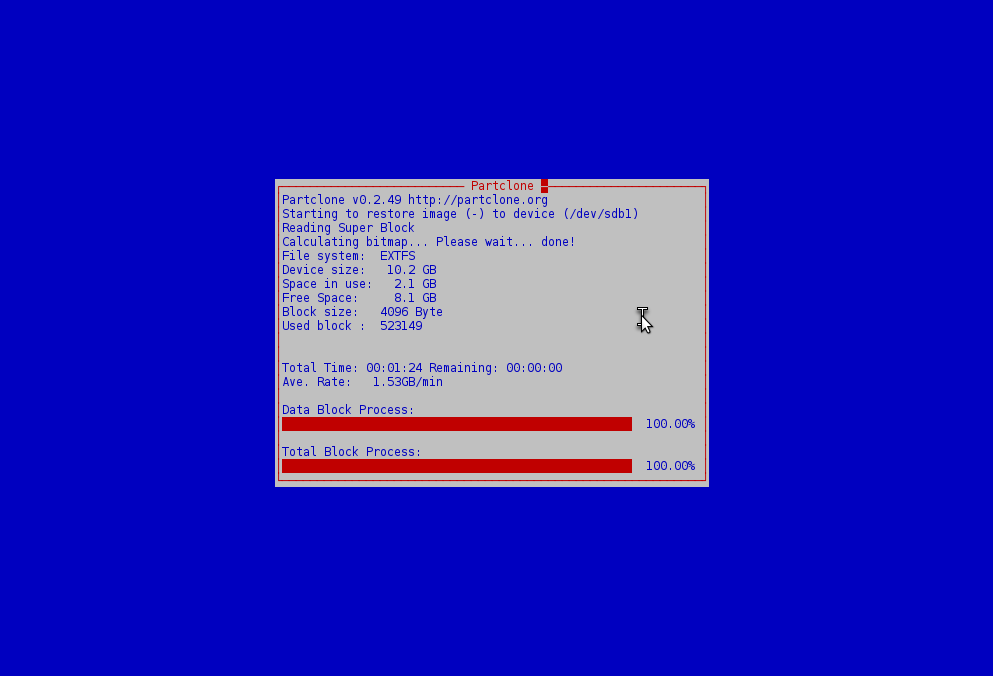

# Parte 1 — Página 8  
# Restauração de Imagens de Backup Salvas em Servidor Samba

Nesta parte veremos como restaurar um backup completo armazenado em um **servidor Samba (SMB)** para um disco local usando o Clonezilla Live.

Esse procedimento é muito útil em redes Windows ou ambientes mistos, onde o backup é centralizado em um compartilhamento de arquivos.

---

# 🔹 Pré-requisitos

Antes de iniciar:

- Máquina Clonezilla e servidor Samba devem estar na **mesma rede**
- Servidor Samba deve estar ativo
- Compartilhamento deve estar com:
  - **permissão de leitura** para o usuário Samba
  - caminho correto (ex: `/clonezilla`)
- Usuário Samba deve estar cadastrado
- Rede deve ter DHCP (ou configurar IP manualmente)

---

# 🔹 Configuração do exemplo

- IP da máquina Clonezilla: **192.168.56.12**  
- IP do servidor Samba: **192.168.56.11**  
- Usuário Samba: **edson**  
- Compartilhamento:

[clonezilla]
path = /home/edson/clonezilla
valid users = edson
writable = yes

---

# 🔹 Passo 1 — Selecionar modo de operação

Escolha: device-image

---

# 🔹 Passo 2 — Selecionar o tipo de acesso

Escolha: samba_server

---

# 🔹 Passo 3 — Informar o IP do servidor Samba

Insira: 192.168.56.11

Pressione Enter (domínio pode ser deixado em branco).

---

# 🔹 Passo 4 — Informar o usuário Samba

Insira o usuário autorizado: edson

---

# 🔹 Passo 5 — Informar o compartilhamento remoto

⚠️ IMPORTANTE  
O nome do compartilhamento deve começar com `/`.

Exemplo: /clonezilla

---

# 🔹 Passo 6 — Inserir senha do usuário Samba

Digite a senha quando solicitado.

---

# 🔹 Passo 7 — Selecionar o modo de execução

Escolha: Expert

---

# 🔹 Passo 8 — Selecionar tipo de operação

Escolha: restoredisk

Assim a imagem será restaurada para o disco local.

---

# 🔹 Passo 9 — Selecionar a imagem de backup

O Clonezilla listará todas as imagens disponíveis no servidor Samba.

Selecione a imagem desejada.

---

# 🔹 Passo 10 — Selecionar o disco destino

Exemplo: sdb

⚠️ O conteúdo do disco será totalmente sobrescrito.

---

# 🔹 Passo 11 — Ajuste dos parâmetros avançados

Desabilite:

- `g auto` → não reinstalar GRUB  
- `e1 auto` → usado apenas em NTFS  
- `e2` → evita uso de SFDISK alternativo  

Mantenha **marcado**:

- `-j2` → importante para manter o boot funcional

---

# 🔹 Passo 12 — Configurar tabela de partição

Escolha: -k1

Isso cria uma tabela de partição proporcional ao disco de destino.

---

# 🔹 Passo 13 — Ação após restauração

Escolha: -p true

---

# 🔹 Passo 14 — Confirmações finais

O Clonezilla pedirá confirmações:

- Pressione **Enter** quando solicitado  
- Digite **y** duas vezes para confirmar  

---

# 🔹 Processo de restauração em andamento

A imagem será copiada do servidor Samba e restaurada para o disco local.

---

📌 Após finalizar, o disco estará restaurado e pronto para uso.

---

➡ **[Próxima Página → Conclusão](pagina-9.md)**  
⬅ **[Voltar para Página 7](pagina-7.md)**

